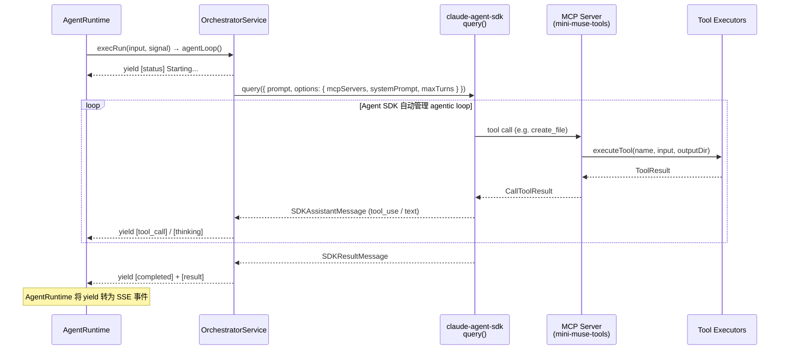
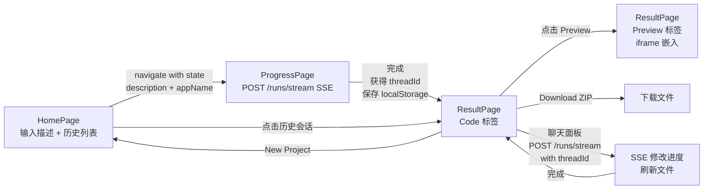

# Mini-Muse 设计文档

## 1. 项目概述

Mini-Muse 是一个 AI 驱动的 Web 应用生成器。用户通过 Web 界面描述想要的应用，AI（Claude）自动生成完整的 React + TypeScript 项目代码，支持实时进度查看、代码浏览、在线预览和 ZIP 下载。

### 核心功能

- 输入自然语言描述，AI 自动生成完整 React + TypeScript 项目
- SSE 实时推送生成进度（基于标准 Agent API 协议）
- 生成结果的文件树浏览与代码预览
- 一键启动生成项目的本地预览（Vite dev server）
- ZIP 打包下载
- **Human-in-the-Loop 迭代修改**：生成完成后通过聊天面板与 AI 对话，增量修改已生成的应用

---

## 2. 系统架构

```mermaid
graph TB
    subgraph Frontend["前端 (React SPA)"]
        HP[HomePage<br/>输入表单 + 历史会话]
        PP[ProgressPage<br/>SSE 进度展示]
        RP[ResultPage<br/>代码浏览 + 预览]
    end

    subgraph Backend["后端 (Egg.js + tegg v4)"]
        subgraph Controllers["Controllers (装饰器路由)"]
            MAC["MuseAgentController<br/>@AgentController()<br/>/api/v1/threads, /api/v1/runs"]
            PC["ProjectController<br/>@HTTPController<br/>/api/v1/projects"]
            HC["HomeController<br/>@HTTPController<br/>SPA fallback"]
        end

        subgraph Services["Services (@SingletonProto)"]
            ORC[OrchestratorService<br/>Agent 主循环<br/>claude-agent-sdk query]
            TS[ToolsService<br/>工具调用]
            PV[PreviewService<br/>预览服务器管理]
        end

        subgraph Runtime["Agent Runtime"]
            AR[AgentRuntime<br/>Thread/Run 生命周期]
            SSE[HttpSSEWriter<br/>SSE 传输]
            STORE[OSSAgentStore<br/>OSS 持久化]
        end

        subgraph Lib["app/lib (纯业务逻辑)"]
            PR[prompts.ts]
            UT[utils.ts]
            subgraph Tools["tools/"]
                MCP[mcpTools.ts<br/>MCP Server 适配]
                AN[analyzer/<br/>需求分析 + 架构规划]
                GN[generator/<br/>代码生成 x6]
                VL[validator/<br/>项目验证]
            end
        end
    end

    subgraph External
        Claude[Claude API]
        OSS[阿里云 OSS<br/>Thread/Run 持久化]
        FS[文件系统<br/>output/]
    end

    HP -->|POST /api/v1/runs/stream<br/>SSE 流| MAC
    PP -->|读取 SSE 流| MAC
    RP -->|GET files/file/download<br/>POST preview| PC

    MAC --> AR
    AR --> ORC
    AR --> SSE
    AR --> STORE
    STORE --> OSS

    ORC -->|query()| MCP
    MCP --> Tools
    Tools --> UT
    ORC --> PR
    Tools --> FS
    PV --> FS
```

---

## 3. 技术栈

| 层级 | 技术 |
|------|------|
| 后端框架 | Egg.js 4 + tegg v4 (TypeScript, 装饰器风格) |
| Agent Runtime | @eggjs/agent-runtime (Thread/Run 模型, SSE) |
| 持久化存储 | OSSAgentStore (阿里云 OSS) |
| AI Agent SDK | @anthropic-ai/claude-agent-sdk |
| 前端框架 | React 18 + React Router v6 |
| 构建工具 | Vite 5 |
| 样式方案 | Tailwind CSS 3 |
| 代码格式化 | Prettier |
| 数据验证 | Zod |
| 压缩下载 | archiver |

---

## 4. 后端模块详解

### 4.1 控制器层（装饰器路由，无需 router.ts）

#### MuseAgentController (`app/controller/MuseAgentController.ts`)

使用 `@AgentController()` 装饰器，自动注册标准 Agent API 路由：

| 方法 | 路由 | 说明 |
|------|------|------|
| POST | `/api/v1/threads` | 创建 Thread（会话） |
| GET | `/api/v1/threads/:id` | 获取 Thread（含消息历史） |
| POST | `/api/v1/runs` | 异步执行 Run |
| POST | `/api/v1/runs/stream` | 流式执行 Run（SSE） |
| POST | `/api/v1/runs/wait` | 同步等待 Run |
| GET | `/api/v1/runs/:id` | 获取 Run 状态 |
| POST | `/api/v1/runs/:id/cancel` | 取消 Run |

实现 `AgentHandler` 接口：
- **`createStore()`**: 创建 `OSSAgentStore`，通过 `OSSObjectStorageClient` 连接阿里云 OSS
- **`execRun(input, signal)`**: async generator，从 `CreateRunInput` 提取参数，委托给 `OrchestratorService.agentLoop()`

#### ProjectController (`app/controller/ProjectController.ts`)

使用 `@HTTPController({ path: '/api/v1/projects' })` 装饰器：

| 方法 | 路由 | 说明 |
|------|------|------|
| GET | `/:threadId/files` | 获取项目文件列表 |
| GET | `/:threadId/file?path=xxx` | 获取文件内容（含路径遍历防护） |
| GET | `/:threadId/download` | ZIP 下载 |
| POST | `/:threadId/preview` | 启动预览服务器 |
| GET | `/:threadId/preview` | 查询预览状态 |

#### HomeController (`app/controller/HomeController.ts`)

使用 `@HTTPController({ path: '/' })` 装饰器，SPA fallback 路由 `GET /*`。

### 4.2 Service 层（@SingletonProto）

#### OrchestratorService (`app/service/orchestrator.ts`)

Agent 主循环，使用 `@anthropic-ai/claude-agent-sdk` 的 `query()` 函数驱动 Agent 循环：

- **`agentLoop(params)`**: 返回 `AsyncGenerator<AgentStreamMessage>`
  - 支持初始生成（`SYSTEM_PROMPT`）和迭代修改（`MODIFY_SYSTEM_PROMPT`）两种模式
  - 通过 `createMuseToolServer(outputDir)` 创建包含 11 个自定义 tool 的 MCP Server
  - 将 MCP Server 注入 `query()` 的 `mcpServers` 选项，Agent SDK 自动处理 tool calling loop
  - 消费 `query()` 返回的 async iterator，将 `SDKAssistantMessage` / `SDKResultMessage` 转换为 `[type] message` 格式 yield 给 AgentRuntime



#### ToolsService (`app/service/tools.ts`)

- 委托 `app/lib/tools/registry.ts` 的工具定义和执行

#### PreviewService (`app/service/preview.ts`)

- 管理生成项目的 Vite dev server 生命周期
- 流程: npm install → 分配空闲端口 → 启动 vite dev server
- 通过 `Map<string, PreviewInfo>` 跟踪预览状态
- 接收 `threadId` 和 `outputDir` 参数，不依赖 TaskManager

### 4.3 纯业务逻辑 (`app/lib/`)

不依赖 Egg.js/tegg 框架：

| 文件 | 说明 |
|------|------|
| `prompts.ts` | Claude 系统提示词 (SYSTEM_PROMPT + MODIFY_SYSTEM_PROMPT) + 用户提示词模板 |
| `utils.ts` | 文件操作、Prettier 格式化、命名转换工具 |
| `tools/registry.ts` | 工具注册表 (11 个工具的定义和执行入口) |
| `tools/mcpTools.ts` | MCP Server 适配层，将 11 个工具注册为 Agent SDK MCP tool |
| `tools/analyzer/` | analyzeRequirements + planArchitecture |
| `tools/generator/` | createConfig / createFile / createComponent / createPage / createHook / createStyle / deleteFile |
| `tools/reader/` | readFile (读取已生成项目文件，用于增量修改) |
| `tools/validator/` | validateProject (文件完整性、导入、类型检查) |

---

## 5. 前端结构

### 5.1 页面

```
frontend/src/
├── pages/
│   ├── HomePage.tsx        # 输入表单 + 历史会话列表 (localStorage)
│   ├── ProgressPage.tsx    # SSE 实时进度展示 + 会话记录持久化
│   └── ResultPage.tsx      # Code/Preview 双标签页 + 可折叠聊天面板
├── components/
│   ├── FileTree.tsx        # 递归文件树
│   ├── CodePreview.tsx     # 带行号的代码展示
│   ├── ProgressLog.tsx     # 进度日志滚动列表
│   └── ChatPanel.tsx       # 迭代修改聊天面板
├── services/
│   ├── api.ts              # API 封装 (fetch + ReadableStream SSE 解析)
│   └── sessionHistory.ts   # 历史会话管理 (localStorage CRUD)
└── types/
    └── index.ts            # 共享类型 (RunObject, ThreadObject, ProgressEvent 等)
```

### 5.2 页面流转



### 5.3 SSE 进度处理

前端通过 `fetch()` + `ReadableStream` 解析 POST `/api/v1/runs/stream` 返回的 SSE 流：

**SSE 事件格式（标准 Agent 协议）：**
```
event: thread.run.created
data: {"id":"run_xxx","threadId":"thread_xxx","status":"queued",...}

event: thread.message.delta
data: {"id":"msg_xxx","delta":{"content":[{"type":"text","text":{"value":"[status] Processing...","annotations":[]}}]}}

event: thread.run.completed
data: {"id":"run_xxx","status":"completed",...}

event: done
data: "[DONE]"
```

**进度信息编码：** 后端 `execRun()` yield 的消息以 `[type]` 前缀编码进度类型，前端解析后映射为 ProgressEvent：
- `[status]` → 状态更新
- `[thinking]` → AI 思考内容
- `[tool_call]` → 工具调用
- `[file_created]` → 文件创建
- `[tool_result]` → 工具执行结果
- `[completed]` → 生成完成
- `[error]` → 错误

### 5.4 迭代修改（Human-in-the-Loop）

ResultPage 右侧集成可折叠聊天面板 (ChatPanel)，支持与 AI 对话式修改：

- **交互流程**: 用户输入修改指令 → POST `/api/v1/runs/stream`（带 threadId）→ 读取 SSE 流 → 完成后刷新文件列表和代码预览
- **对话历史**: 通过 `GET /api/v1/threads/:id` 获取 Thread 消息历史
- **进度展示**: 修改进行中在聊天面板内联显示进度事件

---

## 6. 核心概念映射

| 概念 | 说明 |
|------|------|
| **Thread** | 一个项目会话，包含所有消息历史，threadId 用于标识项目 |
| **Run** | 在 Thread 上的一次执行（初始生成或迭代修改） |
| **AgentStreamMessage** | execRun 的 yield 类型，包含进度文本和 token 用量 |
| **outputDir** | `./output/{threadId}`，生成项目的文件存储位置 |

---

## 7. 关键设计决策

| 决策 | 选择 | 原因 |
|------|------|------|
| Agent 协议 | @AgentController (标准 Thread/Run 模型) | 标准化 API，自动处理 SSE/Thread/Run 生命周期 |
| 持久化存储 | OSSAgentStore (阿里云 OSS) | Thread/Run 数据持久化，支持应用重启后恢复 |
| SSE 实现 | AgentRuntime + HttpSSEWriter | 标准 Agent SSE 事件格式，无需手动管理 SSE 连接 |
| 前端 SSE 消费 | fetch + ReadableStream | POST 请求的流式响应（EventSource 仅支持 GET） |
| Service 层 | @SingletonProto + @Inject | tegg DI，解耦服务间依赖 |
| 进度编码 | `[type] message` 文本前缀 | 在标准 Agent 协议文本消息内编码自定义进度类型 |
| 预览实现 | 在 output 目录启动独立 Vite dev server | 直接复用生成项目的 Vite 配置 |
| Agent SDK | @anthropic-ai/claude-agent-sdk + 自定义 MCP Server | SDK 自动管理 agentic loop 和 tool calling，减少手动循环代码 |
| 迭代修改 | 同一 Thread 上创建新 Run | 共享会话上下文，AI 可读取已生成文件进行增量修改 |
| 历史会话 | localStorage (前端) | 后端无 list threads API，用 localStorage 记录 threadId + 元信息，零后端改动 |

---

## 8. 配置

### 环境变量 (`.env`)

```bash
# Anthropic API (由 claude-agent-sdk 内部使用)
ANTHROPIC_API_KEY=sk-ant-your-api-key-here

# Alibaba Cloud OSS
OSS_REGION=oss-cn-hangzhou
OSS_ENDPOINT=                          # 可选：自定义 endpoint
OSS_ACCESS_KEY_ID=your-ak
OSS_ACCESS_KEY_SECRET=your-sk
OSS_BUCKET=your-bucket
OSS_PREFIX=mini-muse/
```

### Egg.js 配置 (`config/config.default.ts`)

```typescript
config.miniMuse = {
  outputDir: './output',
  maxIterations: 50,
  model: 'claude-sonnet-4-20250514',
  maxTokens: 8192,
};

config.oss = {
  region: process.env.OSS_REGION || 'oss-cn-hangzhou',
  accessKeyId: process.env.OSS_ACCESS_KEY_ID || '',
  accessKeySecret: process.env.OSS_ACCESS_KEY_SECRET || '',
  bucket: process.env.OSS_BUCKET || '',
  prefix: process.env.OSS_PREFIX || 'mini-muse/',
};
```

### tegg 插件 (`config/plugin.ts`)

```typescript
teggConfig: { enable: true, package: '@eggjs/tegg-config' }
tegg: { enable: true, package: '@eggjs/tegg-plugin' }
teggController: { enable: true, package: '@eggjs/controller-plugin' }
```

---

## 9. 目录结构

```
mini-muse/
├── app/
│   ├── controller/             # tegg 装饰器控制器
│   │   ├── MuseAgentController.ts   # @AgentController - 标准 Agent API
│   │   ├── ProjectController.ts     # @HTTPController - 文件/预览 API
│   │   └── HomeController.ts        # @HTTPController - SPA fallback
│   ├── service/                # tegg @SingletonProto 服务
│   │   ├── orchestrator.ts     # Agent 主循环 (claude-agent-sdk query)
│   │   ├── tools.ts            # 工具调用入口
│   │   └── preview.ts          # 预览服务器管理
│   ├── middleware/
│   │   └── errorHandler.ts     # API 错误统一处理
│   ├── lib/                    # 纯业务逻辑 (框架无关)
│   │   ├── prompts.ts
│   │   ├── utils.ts
│   │   └── tools/              # 11 个 AI 工具
│   ├── public/                 # 前端构建产物
│   └── module.json             # tegg 模块声明
├── config/                     # Egg.js + tegg 配置
│   ├── config.default.ts
│   ├── config.local.ts
│   └── plugin.ts
├── frontend/                   # React SPA 源码
│   └── src/
├── docs/
│   └── design.md               # 本文档
├── .env                        # 环境变量 (不提交)
├── .env.example                # 环境变量模板
├── CLAUDE.md                   # Claude Code 项目规范
├── package.json
└── tsconfig.json
```
