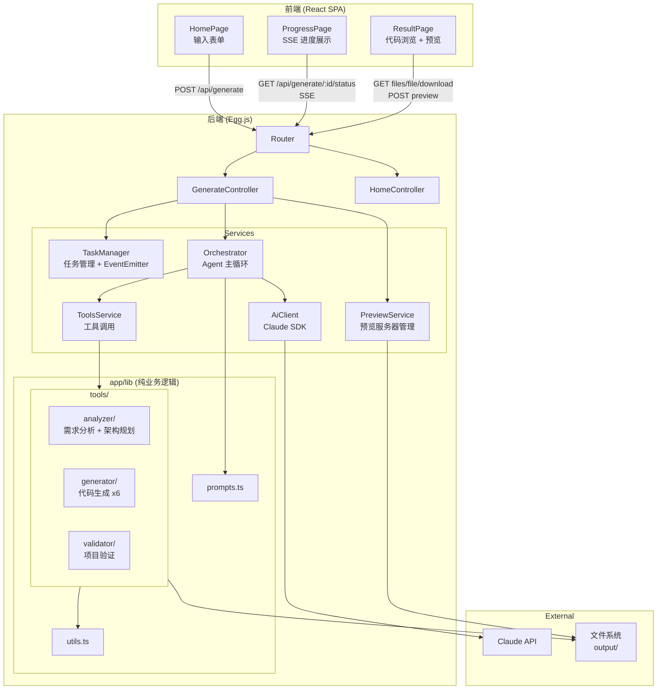
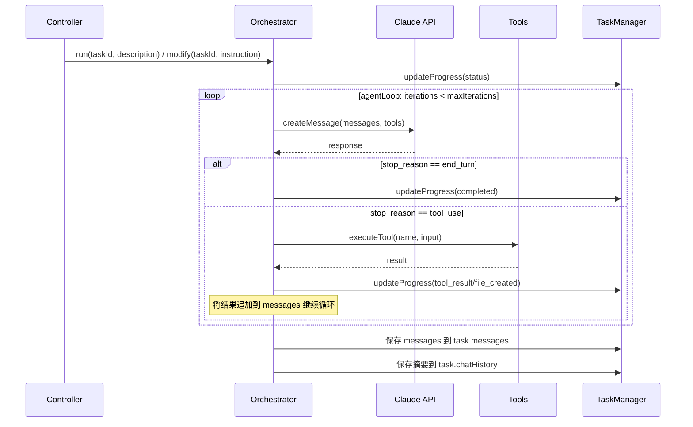
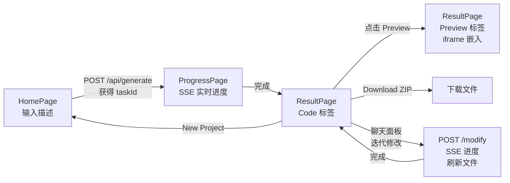

# Mini-Muse 设计文档

## 1. 项目概述

Mini-Muse 是一个 AI 驱动的 Web 应用生成器。用户通过 Web 界面描述想要的应用，AI（Claude）自动生成完整的 React + TypeScript 项目代码，支持实时进度查看、代码浏览、在线预览和 ZIP 下载。

### 核心功能

- 输入自然语言描述，AI 自动生成完整 React + TypeScript 项目
- SSE 实时推送生成进度
- 生成结果的文件树浏览与代码预览
- 一键启动生成项目的本地预览（Vite dev server）
- ZIP 打包下载
- **Human-in-the-Loop 迭代修改**：生成完成后通过聊天面板与 AI 对话，增量修改已生成的应用

---

## 2. 系统架构



---

## 3. 技术栈

| 层级 | 技术 |
|------|------|
| 后端框架 | Egg.js 3 (TypeScript) |
| AI SDK | @anthropic-ai/sdk |
| 前端框架 | React 18 + React Router v6 |
| 构建工具 | Vite 5 |
| 样式方案 | Tailwind CSS 3 |
| 代码格式化 | Prettier |
| 数据验证 | Zod |
| 压缩下载 | archiver |

---

## 4. 后端模块详解

### 4.1 路由 (`app/router.ts`)

| 方法 | 路由 | 说明 |
|------|------|------|
| POST | `/api/generate` | 创建生成任务 |
| GET | `/api/generate/:taskId/status` | SSE 实时进度流 |
| GET | `/api/generate/:taskId/files` | 获取文件列表 |
| GET | `/api/generate/:taskId/file?path=xxx` | 获取文件内容 |
| GET | `/api/generate/:taskId/download` | ZIP 下载 |
| POST | `/api/generate/:taskId/preview` | 启动预览服务器 |
| GET | `/api/generate/:taskId/preview` | 查询预览状态 |
| POST | `/api/generate/:taskId/modify` | 发起迭代修改 |
| GET | `/api/generate/:taskId/chat` | 获取聊天历史 |
| GET | `/api/tasks` | 任务列表 |
| GET | `*` | SPA fallback |

### 4.2 Service 层

#### TaskManager (`app/service/taskManager.ts`)

- 内存 Map 存储任务: `Map<string, TaskInfo>`
- TaskInfo 包含: id, status, description, appName, outputDir, filesCreated, progress[], messages[], chatHistory[], error
- ChatMessage 接口: { role: 'user' | 'assistant', content: string, timestamp: number }
- ProgressEvent 类型: status / thinking / tool_call / tool_result / file_created / completed / error / modify_started / modify_completed
- 通过全局 EventEmitter 实现 SSE 订阅通知

#### Orchestrator (`app/service/orchestrator.ts`)

Agent 主循环，支持初始生成和迭代修改两种模式：

- `run(taskId, description)`: 初始生成，使用 SYSTEM_PROMPT
- `modify(taskId, instruction)`: 迭代修改，使用 MODIFY_SYSTEM_PROMPT，从 task.messages 恢复对话上下文
- 两者共享 `agentLoop(taskId, messages, systemPrompt)` 私有方法
- 循环结束后将 messages 保存到 task.messages，支持多轮修改



#### AiClient (`app/service/aiClient.ts`)

- 封装 Anthropic SDK
- 支持自定义 `baseURL`（通过 `ANTHROPIC_BASE_URL` 环境变量）
- 支持 Bearer Token 认证（通过 `ANTHROPIC_AUTH_TOKEN` 环境变量）
- model 和 maxTokens 从 `config.miniMuse` 读取

#### PreviewService (`app/service/preview.ts`)

- 管理生成项目的 Vite dev server 生命周期
- 流程: npm install → 分配空闲端口 → 启动 vite dev server
- 通过 `Map<string, PreviewInfo>` 跟踪预览状态
- 支持 installing / starting / running / failed 状态查询

### 4.3 纯业务逻辑 (`app/lib/`)

从原 CLI 版本搬迁，不依赖 Egg.js 框架：

| 文件 | 说明 |
|------|------|
| `prompts.ts` | Claude 系统提示词 (SYSTEM_PROMPT + MODIFY_SYSTEM_PROMPT) + 用户提示词模板 (createUserPrompt + createModifyPrompt) |
| `utils.ts` | 文件操作、Prettier 格式化、命名转换工具 |
| `tools/registry.ts` | 工具注册表 (11 个工具的定义和执行入口) |
| `tools/analyzer/` | analyzeRequirements + planArchitecture |
| `tools/generator/` | createConfig / createFile / createComponent / createPage / createHook / createStyle / deleteFile |
| `tools/reader/` | readFile (读取已生成项目文件，用于增量修改) |
| `tools/validator/` | validateProject (文件完整性、导入、类型检查) |

---

## 5. 前端结构

### 5.1 页面

```
frontend/src/
├── pages/
│   ├── HomePage.tsx        # 输入表单 (appName + description)
│   ├── ProgressPage.tsx    # SSE 实时进度展示
│   └── ResultPage.tsx      # Code/Preview 双标签页 + 可折叠聊天面板
├── components/
│   ├── FileTree.tsx        # 递归文件树
│   ├── CodePreview.tsx     # 带行号的代码展示
│   ├── ProgressLog.tsx     # 进度日志滚动列表
│   └── ChatPanel.tsx       # 迭代修改聊天面板
├── services/
│   └── api.ts              # API 封装 (fetch + EventSource)
└── types/
    └── index.ts            # 共享类型
```

### 5.2 页面流转



### 5.3 SSE 进度处理

前端通过 `EventSource` 连接 `/api/generate/:taskId/status`：
- 接收到 progress event 后追加到列表并自动滚动
- 收到 `completed` 或 `error` 类型事件后关闭连接
- 断线自动处理

### 5.4 迭代修改（Human-in-the-Loop）

ResultPage 右侧集成可折叠聊天面板 (ChatPanel)，支持与 AI 对话式修改已生成的项目：

- **交互流程**: 用户输入修改指令 → POST /modify → SSE 监听进度 → 完成后刷新文件列表和代码预览
- **对话历史**: 保留完整聊天记录（ChatMessage[]），支持多轮上下文
- **进度展示**: 修改进行中在聊天面板内联显示进度事件
- **状态流转**: `completed → (modify) → running → completed → (modify) → ...`
- **SSE 连接**: completed 状态不关闭连接，保持订阅等待修改事件，由前端主动关闭

---

## 6. 关键设计决策

| 决策 | 选择 | 原因 |
|------|------|------|
| SSE 实现方式 | `ctx.res` 直接写入 + `ctx.respond = false` | Egg.js 不原生支持 SSE，需绕过框架 response 处理 |
| 任务存储 | 内存 Map (非持久化) | MVP 阶段简单够用，重启后清空可接受。messages 数组保存在 TaskInfo 中以支持多轮修改上下文恢复 |
| 异步执行 | Controller 创建任务后立即返回，Orchestrator 后台运行 | 生成过程耗时长（分钟级），不能阻塞 HTTP 请求 |
| 预览实现 | 在 output 目录启动独立 Vite dev server | 直接复用生成项目的 Vite 配置，零额外改造 |
| Barrel export | 动态检测 `export default` | AI 生成的组件可能用命名导出或默认导出，需自适应 |
| Claude API 认证 | 支持 apiKey / authToken 双模式 | 兼容直连 Anthropic 和内部代理（Bearer Token） |
| 迭代修改方式 | 增量修改 + 对话上下文复用 | AI 基于已有 messages 历史和当前文件结构，只修改需要变动的文件，减少 token 消耗 |
| 修改模式 Prompt | 独立的 MODIFY_SYSTEM_PROMPT | 在原 SYSTEM_PROMPT 基础上追加修改规则，跳过分析/规划阶段直接修改 |

---

## 7. 配置

### 环境变量 (`.env`)

```
# Option 1: Direct Anthropic API
ANTHROPIC_API_KEY=sk-ant-your-api-key-here

# Option 2: Custom proxy endpoint
# ANTHROPIC_BASE_URL=https://your-proxy-endpoint.com/anthropic
# ANTHROPIC_AUTH_TOKEN=your-auth-token-here
```

### Egg.js 配置 (`config/config.default.ts`)

```typescript
config.miniMuse = {
  outputDir: './output',      // 生成项目输出目录
  maxIterations: 50,          // Agent 最大迭代次数
  model: 'claude-sonnet-4-20250514',
  maxTokens: 8192,
};
```

---

## 8. 目录结构

```
mini-muse/
├── app/
│   ├── controller/          # Egg.js 控制器
│   │   ├── generate.ts      # 生成 API (CRUD + SSE + 预览)
│   │   └── home.ts          # SPA fallback
│   ├── service/             # Egg.js 服务
│   │   ├── aiClient.ts      # Claude SDK 封装
│   │   ├── orchestrator.ts  # Agent 主循环
│   │   ├── taskManager.ts   # 任务管理 + EventEmitter
│   │   ├── tools.ts         # 工具调用入口
│   │   └── preview.ts       # 预览服务器管理
│   ├── middleware/
│   │   └── errorHandler.ts  # API 错误统一处理
│   ├── lib/                 # 纯业务逻辑 (框架无关)
│   │   ├── prompts.ts
│   │   ├── utils.ts
│   │   └── tools/           # 11 个 AI 工具
│   ├── public/              # 前端构建产物
│   └── router.ts
├── config/                  # Egg.js 配置
├── frontend/                # React SPA 源码
│   └── src/
├── typings/                 # Egg.js 类型声明
├── docs/
│   └── design.md            # 本文档
├── .env                     # 环境变量 (不提交)
├── CLAUDE.md                # Claude Code 项目规范
├── package.json
└── tsconfig.json
```
